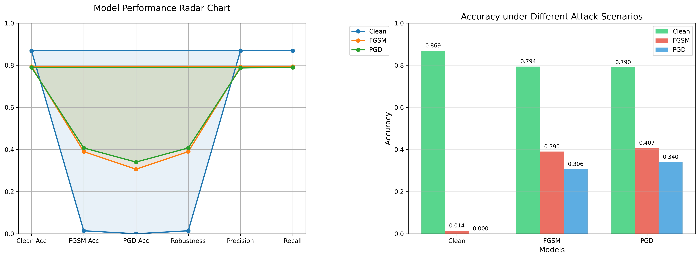
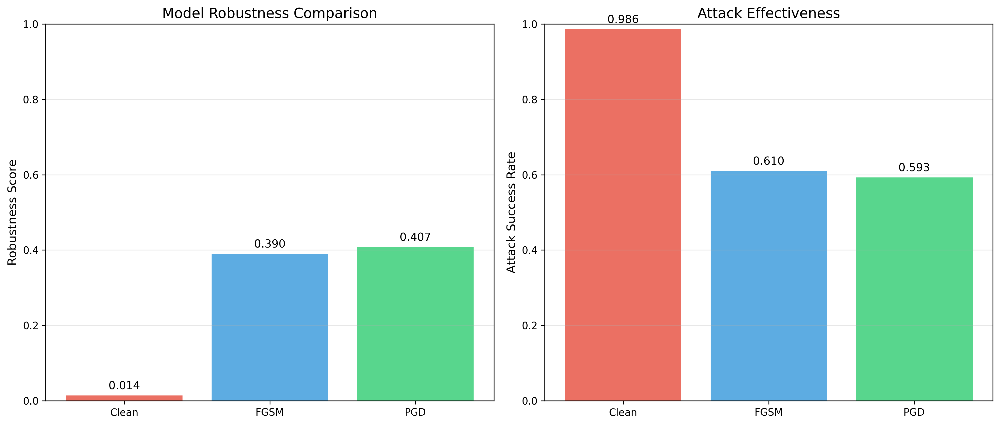

# 🛡️ CIFAR-10 Adversarial Attacks & Defenses

A comprehensive study of adversarial machine learning on CIFAR-10, implementing both attack strategies and defense mechanisms to enhance model robustness against adversarial examples.

## 📁 Project Structure

📁 Data          → Contains CIFAR-10 raw data and preprocessed tensors;

📁 Docs          → Contains the plots and documentation of the projects;

📁 Models        → Contains model definitions and saved checkpoints;

📁 Src           → Contains implementation of attacks, model training, evaluation and data preprocessing;

## 📋 Table of Contents
- [General Information](#general-information-ℹ️)
- [Key Features](#key-features-✨)
- [Experimental Results](#experimental-results-📊)
- [Installation & Usage](#installation--usage-🚀)
- [Technologies Used](#technologies-used-🛠️)
- [Project Status](#project-status-📈)

## General Information ℹ️

This project provides an in-depth exploration of adversarial machine learning, demonstrating how neural networks can be both vulnerable to and protected against carefully crafted adversarial attacks. The implementation includes:

- **🧨 Attack Methods**: FGSM (Fast Gradient Sign Method) and PGD (Projected Gradient Descent)
- **🛡️ Defense Strategies**: Adversarial training with mixed clean/adversarial batches
- **📊 Evaluation Framework**: Comprehensive metrics for robustness assessment
- **📈 Visualization**: Comparative analysis of model performance and decision boundaries

### Research Goals 🎯

1. **Vulnerability Analysis**: Demonstrate CNN susceptibility to gradient-based attacks
2. **Defense Implementation**: Adversarial training with adaptive attack generation
3. **Trade-off Quantification**: Measure robustness-accuracy relationship
4. **Reproducible Framework**: Provide modular, well-documented code for further research

## Key Features ✨

### 🔧 Core Components
- **Adversarial Attack Pipeline**: FGSM & PGD implementations with customizable parameters
- **Robust Training System**: Hybrid training with 50% clean / 50% adversarial examples
- **Modular Evaluation**: Clean accuracy, adversarial robustness, and advanced metrics
- **Cross-Platform Compatibility**: Works seamlessly on Colab and local environments

### 📈 Evaluation Metrics
- **Clean Accuracy**: Standard classification performance
- **Adversarial Accuracy**: Performance under attack
- **Attack Success Rate (ASR)**: Effectiveness of adversarial examples
- **Robustness Score**: Model resistance to perturbations
- **Distortion Analysis**: L2 norm of adversarial perturbations

## Experimental Results 📊

### 📋 Performance Summary

| Model Type | Clean Accuracy | FGSM Accuracy (ε=0.03) | PGD Accuracy (ε=0.03) | Robustness |
|------------|----------------|------------------------|-----------------------|------------|
| **Standard CNN** | 86.91%         | 1.41%                  | 0.0%                  | 0.141      |
| **FGSM Trained** | 79.39%         | 39.01%                 | 30.64%                | 0.390      |
| **PGD Trained** | 78.98%         | 40.75%                 | 34.03%                | 0.407      |

### 📈 Key Findings

- **🔄 Robustness-Accuracy Trade-off**: Adversarial training (FGSM or PGD) reduces clean accuracy by about 7–8 percentage points compared to the standard model, but drastically improves robustness (from 0.141 to over 0.4).
- **🎯 Attack Effectiveness**: FGSM and PGD attacks severely degrade the standard model’s accuracy, reducing it by ~85% and ~87% respectively compared to its clean accuracy.
- **🛡️ Defense Impact**: PGD training boosts FGSM accuracy from 1.41% to 40.75%, a ~29× gain in adversarial robustness.
- **⚡ Transferability**: The FGSM-trained model retains partial resistance to PGD attacks (30.64%), suggesting moderate robustness even against stronger adversaries.

### 📊 Visualization Examples

### 🛠️ Technologies Used

- **Python 3.8+** - Core programming language
- **PyTorch 2.0+** - Deep learning framework  
- **NumPy & Matplotlib** - Numerical computing and visualization
- **Scikit-learn** - Evaluation metrics
- **Torchvision** - Dataset handling and transforms

### 🎯 Planned Enhancements

- Ensemble adversarial training methods
- Robustness curves across ε values
- Additional attack methods (C&W, AutoAttack)
- Explainable AI for adversarial examples
- Real-time adversarial detection

## Project Status
The Project is: **_In_Progress_**. 🚧
